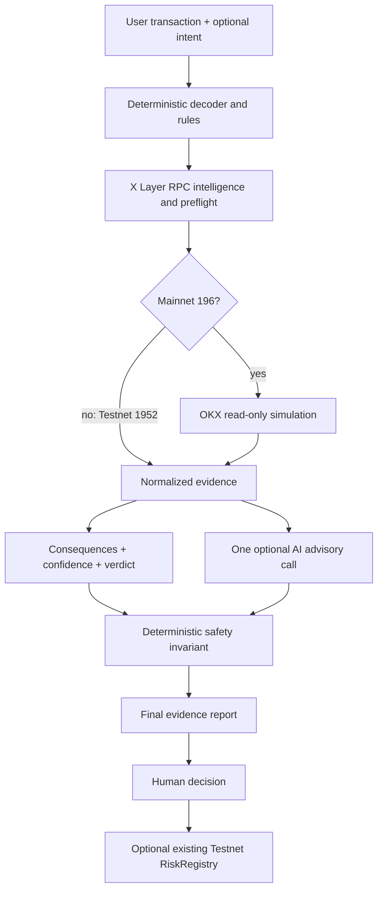

# XGuard AI

> **Know what a transaction does before you sign.**

XGuard AI is an explainable pre-sign security layer for X Layer. It decodes calldata, applies deterministic security rules, inspects live X Layer RPC facts, compares user intent with observed behavior, and uses AI only as an advisory evidence interpreter. On X Layer Mainnet, V4 can add read-only OKX OnchainOS Transaction Simulation evidence. No provider is treated as a safety oracle, and nothing connects, signs, or broadcasts automatically.

**Production:** [xguard-ai-six.vercel.app](https://xguard-ai-six.vercel.app) · **Source:** [github.com/leafwithered/xguard-ai](https://github.com/leafwithered/xguard-ai) · **Demo:** [xguard-ai-build-x-demo.mp4](https://github.com/leafwithered/xguard-ai/blob/main/demo/xguard-ai-build-x-demo.mp4)

**X account:** [@AevrynHQ](https://x.com/AevrynHQ) · **Build X post:** [View post](https://x.com/AevrynHQ/status/2090382549205873099)


## What judges can verify

1. **Safe Transfer** — `8 LOW`, an explainable deterministic baseline.
2. **Ambiguous Approval** — deterministic `20 LOW`, `LOW` confidence, `UNDETERMINED`; `approve(address,uint256)` is not forced into ERC20 semantics without token-standard evidence.
3. **Suspicious Airdrop** — deterministic `78 HIGH`, `MISMATCH`; claim intent conflicts with `setApprovalForAll(true)`.
4. **Live OKX Mainnet Simulation** — a public historical approval fixture can be loaded explicitly for real, read-only provider evidence on Chain `196`.
5. **Existing receipt** — a real, user-signed RiskRegistry receipt is verifiable on X Layer Testnet (`1952`).

Judge Mode only loads examples and navigates. The user must explicitly select **Analyze risk**. It never connects a wallet, signs, records, or broadcasts.

## V4 Preview status

`codex/v4-okx-simulation` is a Preview-only candidate based on frozen V3 Stable commit `04575cc764163c7cb99b948c050e974e4cd20a2e` (`v3.1.1-stable`). It has not been merged into `main` and has not changed the canonical Production deployment.

- Testnet `1952` retains the V3 RPC/preflight path and never calls the Mainnet simulator.
- Mainnet `196` adds optional OKX OnchainOS simulation with `chainIndex: "196"`.
- A Live Provider badge appears only for normalized `AVAILABLE` evidence with HTTP `200` and business code `0` on Mainnet `196`.
- RPC and OKX simulation remain separate evidence sources; disagreement is surfaced and lowers confidence.
- Missing credentials, timeout, rate limiting, malformed responses, and provider errors never disable deterministic analysis.
- Empty provider risk entries mean only that no entries were returned—not that a transaction is safe.

See [V4 evidence and live verification](docs/V4_OKX_SIMULATION.md), [integration guide](docs/INTEGRATION.md), and [75–90 second demo](docs/DEMO.md).

## Evidence hierarchy

XGuard reports these layers separately:

| Layer | Meaning |
| --- | --- |
| Final Risk Score | `max(Deterministic Known Risk, AI Advisory)` |
| Deterministic Known Risk | Rule- and decoder-backed heuristic severity |
| AI Advisory | Evidence-grounded score/explanation; may raise but never lower the deterministic floor |
| Confidence / Verdict / Execution | Whether evidence is sufficient, whether the case is assessed, and current-state preflight outcome |
| Consequences / Intent | What signing does and whether that matches the user’s stated goal |
| X Layer RPC | Bytecode, scoped EIP-1967 implementation-slot check, `eth_call`, and `eth_estimateGas` |
| OKX Simulation | Additional Mainnet provider evidence: intention, changes, gas, failure reason, and risk entries |

The primary score is never labeled “known risk” when AI raised it. For example, an Ambiguous Approval may show deterministic `20 LOW`, AI `75 HIGH`, and final `75 HIGH` while remaining `LOW` confidence and `UNDETERMINED`.

## Deterministic Safety Invariant

`Final Risk = max(Deterministic Known Risk, AI Advisory)`

AI can explain evidence or raise final risk, but it cannot reduce deterministic known-risk signals, rewrite RPC/simulation facts, change the deterministic verdict, or turn missing evidence into proof of safety. If the AI provider is missing, unavailable, slow, or malformed, XGuard falls back to Local Analysis.

## Why X Layer and OKX

X Layer is where transaction intent, contract behavior, and user confirmation meet. XGuard uses X Layer RPC for chain-specific bytecode and bounded preflight evidence on both supported networks. The existing `RiskRegistry` creates a compact, public proof that a user reviewed an assessment on Testnet without executing the analyzed transaction.

On X Layer Mainnet, OKX OnchainOS adds an independent read-only simulation view. That evidence improves consequence visibility but is deliberately bounded: provider evidence is not a safety verdict, and Testnet `1952` is never sent to the Mainnet-only simulation endpoint.

## Architecture



`lib/analyze-pipeline.ts` owns evidence-first orchestration. `lib/evidence.ts` creates a bounded, normalized evidence object before `lib/ai/provider.ts` is called. The provider adapter is configured only on the server through `AI_API_KEY`, `AI_BASE_URL`, and `AI_MODEL`; the public client does not expose or prove the upstream provider identity.

## X Layer integration

| Analysis network | Chain ID | RPC | OKX Transaction Simulation |
| --- | ---: | --- | --- |
| X Layer Testnet | `1952` | `https://testrpc.xlayer.tech/terigon` | Unsupported; never called |
| X Layer Mainnet | `196` | `https://rpc.xlayer.tech` | V4 Preview, `chainIndex: "196"` |

RPC checks are isolated and timeout-bounded:

- `eth_getCode` identifies EOA versus contract and reports bytecode size.
- `eth_getStorageAt` checks only the EIP-1967 implementation slot; it does not exclude every proxy type.
- `eth_call` records current-state success/revert evidence.
- `eth_estimateGas` reports an estimate when available.

These are bounded preflight checks, not an audit or full trace/state-diff guarantee.

## Verified on-chain evidence

- Network: X Layer Testnet (`1952`)
- RiskRegistry: [`0xf4505A4e8dEca4659b8A2054555788Ddc1f5AcE5`](https://www.okx.com/web3/explorer/xlayer-test/address/0xf4505A4e8dEca4659b8A2054555788Ddc1f5AcE5)
- Deployment transaction: `0xf4169572833b69bb7a5cb234d092f7ab1b27e15d2520e6544591c2358533c75b`
- Verified user transaction: [`0x1492bc179e98fe5fe79add3528f8f1f26990ab37e189a98d4c4a052d6fd11bcb`](https://www.okx.com/web3/explorer/xlayer-test/tx/0x1492bc179e98fe5fe79add3528f8f1f26990ab37e189a98d4c4a052d6fd11bcb)
- Receipt: success; `RiskAssessmentRecorded` emitted with score `12`

The deployed V1 contract holds no funds and creates no token. Contract V2 remains a proposal only; V4 deploys no contract and creates no transaction.

## Local development

```bash
pnpm install --frozen-lockfile
copy .env.example .env.local
pnpm run dev
```

Open `http://localhost:3000`. Without AI or OKX credentials, deterministic Local Analysis and the Testnet RPC path remain usable.

### Server-side configuration

| Variable | Purpose |
| --- | --- |
| `AI_API_KEY` | AI provider key |
| `AI_BASE_URL` | OpenAI-compatible base URL |
| `AI_MODEL` | Provider model identifier |
| `XLAYER_RPC_URL` | Testnet RPC |
| `XLAYER_MAINNET_RPC_URL` | Mainnet RPC |
| `OKX_API_KEY` | OKX API key |
| `OKX_SECRET_KEY` | OKX signing secret |
| `OKX_API_PASSPHRASE` | OKX passphrase |
| `NEXT_PUBLIC_RISK_REGISTRY_ADDRESS` | Public deployed Testnet registry address |

`DEPLOYER_PRIVATE_KEY` is needed only for explicitly authorized contract deployment and must never be configured in the browser or committed. V4 does not use it.

## Verification

```bash
pnpm run build
pnpm run contract:test
pnpm run risk:test
pnpm run ai:test
pnpm run decoder:test
pnpm run fusion:test
pnpm run intelligence:test
pnpm run transaction-analyzer:test
pnpm run judge:test
pnpm run analysis-state:test
pnpm run consequence:test
pnpm run intent:test
pnpm run pipeline:test
pnpm run token-standard:test
pnpm run security-benchmark:test
pnpm run simulation:test
pnpm run presentation:test
```

The V3.1 security corpus contains 57 adversarial and invariant cases. V4 adds authentication, network-boundary, normalization, failure-isolation, evidence-immutability, live-badge eligibility, and score-semantics regression coverage.

## Limitations

- Scores are heuristic severity, not calibrated fraud probabilities.
- RPC preflight and OKX simulation are current-state, bounded evidence—not proof of safety.
- Contract reputation and verified-source provenance are not yet integrated.
- AI and deterministic rules can miss malicious behavior or create false positives.
- This prototype has a basic in-memory API rate limit and no availability SLA.

## Historical evidence note

The unchanged public video captures the earlier stable Production Judge path, including the historical Unlimited Approval result `72 HIGH`. It is retained as stable Production evidence, not as the current V4 Preview Judge semantics. The current Preview path uses selector-hardened Ambiguous Approval instead.

## License

Released under the [MIT License](LICENSE). Submission fields are in [docs/SUBMISSION.md](docs/SUBMISSION.md); contact email remains only in the official form.
