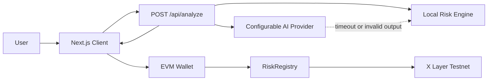

# XGuard AI

XGuard AI is AI-powered transaction risk intelligence for X Layer. It reviews an EVM transaction before signing, explains detected risks, and lets the user record a compact assessment receipt on X Layer Testnet.

**Live Demo:** https://xguard-ai-six.vercel.app  ·  **GitHub:** https://github.com/leafwithered/xguard-ai

**Demo asset:** `demo/xguard-ai-build-x-demo.mp4` (1080p H.264, approximately 2:29)

## Project Overview

The MVP supports wallet connection, X Layer Testnet detection and switching, transaction input validation, configurable third-party AI analysis, deterministic local fallback analysis, user confirmation, and an optional on-chain risk record.

### Verified MVP

- Real AI Mode returns structured risk analysis through an OpenAI-compatible Responses API.
- Local Analysis keeps the product usable when the configured AI provider is unavailable or returns invalid output.
- Every report includes a `0–100` Risk Score, plain-language reasons, and a recommendation.
- Recording is optional and only starts after explicit user review and wallet confirmation.
- `RiskRegistry` is deployed on X Layer Testnet, and a real user-signed interaction is publicly verified below.
- The production deployment has been verified with a real AI Analysis response.

## Problem

Wallet confirmation screens expose raw addresses, values, and calldata that many users cannot interpret. Malicious approvals, unknown selectors, zero-address transfers, and social-engineering prompts can look similar to normal transactions.

## Solution

XGuard AI converts transaction fields into a `0–100` risk score, a `LOW / MEDIUM / HIGH` level, concise reasons, and an actionable recommendation. The app never signs automatically; users retain final control.

The hybrid design combines a deterministic Risk Engine with an optional third-party OpenAI-compatible explanation layer. If the provider is unavailable, Local Analysis remains fully demoable.

## How XGuard AI Works

1. Connect an EVM wallet.
2. Detect or switch to X Layer Testnet (`1952`).
3. Enter `from`, `to`, value, calldata, and context.
4. Validate the input and run the Local Risk Engine.
5. Add provider-backed AI explanation when configured, or keep Local Analysis.
6. Review the score, reasons, and recommendation before signing.
7. Confirm explicitly and record the assessment hash and score through `RiskRegistry`.

## Architecture



## AI Risk Engine

`lib/ai/provider.ts` isolates provider-specific behavior. Configure any OpenAI-compatible third-party provider using `AI_API_KEY`, `AI_BASE_URL`, and `AI_MODEL`. The adapter attempts `/v1/responses` first and then `/v1/chat/completions`. Output is validated before use.

The deterministic Local Risk Engine checks zero addresses, native value thresholds, ERC20/NFT approval selectors, unlimited ERC20 approvals, transfer methods, unknown selectors, empty calldata, unknown-contract context, and common social-engineering signals.

The browser never receives `AI_API_KEY`. Missing configuration, timeouts, unsupported endpoints, and malformed output automatically use Local Analysis.

The adapter is intentionally provider-neutral: `AI_BASE_URL` may point at a third-party OpenAI-compatible base URL, with or without `/v1`. It tries `/v1/responses` first and uses `/v1/chat/completions` when Responses is unsupported.

## X Layer Integration

- Network: X Layer Testnet
- Chain ID: `1952`
- Native token: `OKB`
- Official RPC: `https://testrpc.xlayer.tech/terigon`
- Explorer: `https://www.okx.com/web3/explorer/xlayer-test`

## Smart Contract

`contracts/RiskRegistry.sol` stores an assessment by `analysisHash` with the submitting user, risk score, and timestamp. It holds no funds and creates no token.

```solidity
recordAssessment(bytes32 analysisHash, uint8 riskScore)
```

Deployed testnet contract: `0xf4505A4e8dEca4659b8A2054555788Ddc1f5AcE5`  
Deployment transaction: `0xf4169572833b69bb7a5cb234d092f7ab1b27e15d2520e6544591c2358533c75b`  
[Open in X Layer Testnet Explorer](https://www.okx.com/web3/explorer/xlayer-test/address/0xf4505A4e8dEca4659b8A2054555788Ddc1f5AcE5)

### Verified user interaction

- Network: X Layer Testnet (`1952`)
- Contract: `0xf4505A4e8dEca4659b8A2054555788Ddc1f5AcE5`
- Method: `recordAssessment(bytes32,uint8)`
- User interaction transaction: `0x1492bc179e98fe5fe79add3528f8f1f26990ab37e189a98d4c4a052d6fd11bcb`
- Receipt status: success (`0x1`)
- Event: `RiskAssessmentRecorded` emitted with risk score `12`
- Explorer: [View transaction](https://www.okx.com/web3/explorer/xlayer-test/tx/0x1492bc179e98fe5fe79add3528f8f1f26990ab37e189a98d4c4a052d6fd11bcb)

## Tech Stack

- Next.js 14, React, TypeScript
- viem and injected EVM wallets
- Configurable OpenAI-compatible provider adapter
- Solidity 0.8.24, Hardhat, ethers
- X Layer Testnet

## Local Development

```bash
npm install
copy .env.example .env.local
npm run dev
```

Open `http://localhost:3000`. The app works without AI credentials using Local Analysis.

The public production deployment is available at https://xguard-ai-six.vercel.app.

## Environment Variables

| Variable | Purpose |
| --- | --- |
| `AI_API_KEY` | Third-party AI provider key; server-side only |
| `AI_BASE_URL` | OpenAI-compatible provider base URL, with or without `/v1` |
| `AI_MODEL` | Provider-specific model identifier |
| `XLAYER_RPC_URL` | X Layer Testnet deployment RPC |
| `NEXT_PUBLIC_RISK_REGISTRY_ADDRESS` | Deployed registry address used by the browser |
| `DEPLOYER_PRIVATE_KEY` | Deployment wallet key; never commit |

## Contract Deployment

```bash
npm run contract:compile
npm run contract:test
npm run contract:deploy
```

Deployment requires a user-controlled private key and testnet OKB. Never commit `.env.local` or expose a private key to the browser.

## Testing

```bash
npm run build
npm run contract:compile
npm run contract:test
npm run risk:test
npm run ai:test
```

The browser smoke path is documented in [docs/DEMO.md](docs/DEMO.md). The API returns `400` for invalid transaction input and keeps Local Analysis available when the configured provider fails.

`npm run contract:deploy` is intentionally not part of the automated test run because it requires a user-controlled deployer key and testnet OKB.

## Demo Flow

Use the example in [docs/DEMO.md](docs/DEMO.md) to demonstrate deterministic detection of a zero-address, unlimited approval, large value, unknown contract, and suspicious claim context. After deployment, connect a wallet and record the assessment on X Layer Testnet.

## Security Disclaimer

XGuard AI is an advisory prototype, not an audit, wallet firewall, or guarantee of transaction safety. AI and deterministic rules can miss malicious behavior or produce false positives. Verify contracts, permissions, amounts, and destinations independently before signing.

## Limitations

- The MVP does not simulate state changes or prove contract safety.
- Contract reputation and verified source metadata are not yet integrated.
- The on-chain registry stores the submitting address, score, hash, and timestamp only; it does not execute or protect transactions.
- AI provider behavior depends on the configured third-party service and its compatibility with the adapter.

## Roadmap

- Fetch verified contract metadata and bytecode provenance.
- Simulate state changes before signing.
- Decode calldata and human-readable approval amounts.
- Add address reputation and phishing intelligence.
- Deploy and verify `RiskRegistry` on X Layer mainnet after the required testnet phase.

## Submission

See [docs/SUBMISSION.md](docs/SUBMISSION.md) for the hackathon evidence checklist. Unknown external values remain marked `TODO_USER`; no deployment evidence is fabricated.
