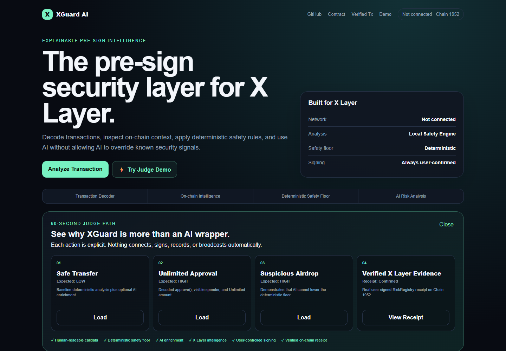
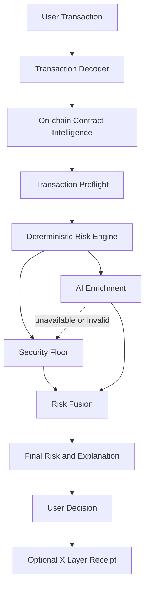

# XGuard AI

> **The explainable pre-sign security layer for X Layer.**

XGuard AI decodes transaction intent, inspects real X Layer on-chain context, runs a transaction preflight, and fuses deterministic security rules with AI explanation. AI may raise risk, but it cannot reduce known deterministic security signals. Users remain in control of every wallet action.

**Live Demo:** https://xguard-ai-six.vercel.app  ·  **GitHub:** https://github.com/leafwithered/xguard-ai  ·  **Demo Video:** https://github.com/leafwithered/xguard-ai/blob/main/demo/xguard-ai-build-x-demo.mp4

**Project X:** https://x.com/AevrynHQ  ·  **Build X Post:** https://x.com/AevrynHQ/status/2090382549205873099

**Demo asset:** `demo/xguard-ai-build-x-demo.mp4` (1080p H.264, approximately 2:56)



## 60-Second Judge Path

1. Open the Live Demo and select **⚡ Try Judge Demo**.
2. Load **Safe Transfer**, then explicitly click **Analyze risk** to see the LOW baseline.
3. Load **Unlimited Approval** to inspect `approve(address,uint256)`, the spender, and `Amount: Unlimited`.
4. Load **Suspicious Airdrop** to see the deterministic safety floor remain at `100 HIGH` through AI enrichment.
5. Select **Load Verified X Layer Receipt** to inspect the existing confirmed RiskRegistry transaction from real X Layer RPC data.

Judge Mode only loads examples, navigates, and explains. It never auto-analyzes, connects a wallet, signs, records an assessment, or broadcasts a transaction.

## Why XGuard Is Different

- **Deterministic first:** known security rules and decoded permissions establish an auditable floor.
- **Transparent AI fusion:** `Final Risk = max(Deterministic Floor, AI Assessment)` is shown in the product.
- **Real X Layer intelligence:** `eth_getCode`, EIP-1967 inspection, `eth_call`, and `eth_estimateGas` provide live context with isolated timeouts.
- **Explainable evidence:** risk signals are labeled `RULE`, `DECODER`, or `AI`; unavailable data is never fabricated.
- **User-controlled signing:** analysis and receipt recording are advisory and require explicit user actions.

## Stable Production Baseline

V2 is live on the canonical Vercel Production URL. Production uses the verified official OpenAI API through the provider-neutral adapter. The V1 RiskRegistry evidence and every public URL remain unchanged.

- Safe Transfer: `8 LOW`, Hybrid Analysis
- Unlimited Approval: `72 HIGH`, decoded ERC20 `approve`, spender and `Amount: Unlimited` visible
- Suspicious Airdrop: `100 HIGH`, deterministic safety floor preserved through AI enrichment
- Clear Analysis, wallet connection, X Layer Testnet switching, and explicit user confirmation are included
- Contract V2 is documented as a proposal only; no new contract or chain transaction was introduced

## Project Overview

The application supports wallet connection, X Layer Testnet detection and switching, transaction decoding, real RPC intelligence, bounded preflight checks, provider-neutral AI analysis, deterministic fallback analysis, post-hoc transaction inspection, Judge Mode, user confirmation, and an optional on-chain risk receipt.

### Verified V2 Product

- Hybrid Analysis returns structured risk analysis through an OpenAI-compatible Responses API without allowing AI to weaken deterministic signals.
- Local Analysis keeps the product usable when the configured AI provider is unavailable or returns invalid output.
- Every report includes a `0–100` Risk Score, plain-language reasons, and a recommendation.
- Calldata decoding exposes approval spenders, transfer recipients, token amounts, unlimited approvals, and NFT operator permissions.
- Demo presets make Safe Transfer, Unlimited Approval, and Suspicious Airdrop paths reproducible without auto-analyzing or signing.
- Recording is optional and only starts after explicit user review and wallet confirmation.
- The UI waits for a successful X Layer receipt before displaying `Confirmed`.
- `RiskRegistry` is deployed on X Layer Testnet, and a real user-signed interaction is publicly verified below.
- The production deployment has been verified with a real AI Analysis response.

## Problem

Wallet confirmation screens expose raw addresses, values, and calldata that many users cannot interpret. Malicious approvals, unknown selectors, zero-address transfers, and social-engineering prompts can look similar to normal transactions.

## Solution

XGuard AI converts transaction fields into a `0–100` risk score, a `LOW / MEDIUM / HIGH` level, concise reasons, and an actionable recommendation. The app never signs automatically; users retain final control.

The hybrid design combines a deterministic Risk Engine with a configurable OpenAI-compatible explanation layer. Production currently uses official OpenAI, while the adapter remains provider-neutral. If the provider is unavailable, Local Analysis remains fully demoable.

## How XGuard AI Works

1. Connect an EVM wallet.
2. Detect or switch to X Layer Testnet (`1952`).
3. Enter `from`, `to`, value, calldata, and context.
4. Decode supported calldata and inspect the target through real X Layer RPC calls.
5. Run bounded `eth_call` and `eth_estimateGas` preflight checks—not a full state-diff simulation.
6. Run the deterministic Local Risk Engine and merge optional AI enrichment above its safety floor.
7. Review the score, source-labeled signals, intelligence, reasons, and recommendation before signing.
8. Optionally confirm explicitly and record the assessment hash and score through `RiskRegistry`.

## Architecture



## AI Risk Engine

`lib/ai/provider.ts` isolates provider-specific behavior. Configure an official or third-party OpenAI-compatible provider using `AI_API_KEY`, `AI_BASE_URL`, and `AI_MODEL`. The adapter attempts `/v1/responses` first and then `/v1/chat/completions`. Output is validated before use.

The deterministic Local Risk Engine checks zero addresses, exact bigint native value thresholds, decoded ERC20/NFT approvals, unlimited permissions, transfer methods, malformed and unknown calldata, unknown-contract context, and common social-engineering signals.

The browser never receives `AI_API_KEY`. Missing configuration, timeouts, unsupported endpoints, and malformed output automatically use Local Analysis.

The adapter is intentionally provider-neutral: `AI_BASE_URL` may point at a third-party OpenAI-compatible base URL, with or without `/v1`. It tries `/v1/responses` first and uses `/v1/chat/completions` when Responses is unsupported. `mergeRiskResults` guarantees `finalScore >= deterministicScore` and preserves deterministic critical signals.

## X Layer Integration

- Network: X Layer Testnet
- Chain ID: `1952`
- Native token: `OKB`
- Official RPC: `https://testrpc.xlayer.tech/terigon`
- Explorer: `https://www.okx.com/web3/explorer/xlayer-test`

### On-chain Intelligence and Preflight

For each valid destination, the server performs isolated, timeout-bounded X Layer RPC checks:

- `eth_getCode` distinguishes an EOA from a smart contract and reports actual bytecode size.
- `eth_getStorageAt` inspects the EIP-1967 implementation slot without claiming trust, verification, or audit status.
- `eth_call` reports whether the proposed call succeeds or reverts and decodes standard `Error(string)` and `Panic(uint256)` data when available.
- `eth_estimateGas` reports an estimate when the RPC can produce one.

RPC failure never blocks deterministic analysis. Unavailable results are labeled `Unavailable`; XGuard does not invent contract reputation or simulation output. The Transaction Analyzer can also load a real X Layer transaction and receipt for clearly labeled **post-hoc** analysis.

## Smart Contract

`contracts/RiskRegistry.sol` stores an assessment by `analysisHash` with the submitting user, risk score, and timestamp. It holds no funds and creates no token.

```solidity
recordAssessment(bytes32 analysisHash, uint8 riskScore)
```

Deployed testnet contract: `0xf4505A4e8dEca4659b8A2054555788Ddc1f5AcE5`  
Deployment transaction: `0xf4169572833b69bb7a5cb234d092f7ab1b27e15d2520e6544591c2358533c75b`  
[Open in X Layer Testnet Explorer](https://www.okx.com/web3/explorer/xlayer-test/address/0xf4505A4e8dEca4659b8A2054555788Ddc1f5AcE5)

### Verified user interaction

- Network: X Layer Testnet (`1952`)
- Contract: `0xf4505A4e8dEca4659b8A2054555788Ddc1f5AcE5`
- Method: `recordAssessment(bytes32,uint8)`
- User interaction transaction: `0x1492bc179e98fe5fe79add3528f8f1f26990ab37e189a98d4c4a052d6fd11bcb`
- Receipt status: success (`0x1`)
- Event: `RiskAssessmentRecorded` emitted with risk score `12`
- Explorer: [View transaction](https://www.okx.com/web3/explorer/xlayer-test/tx/0x1492bc179e98fe5fe79add3528f8f1f26990ab37e189a98d4c4a052d6fd11bcb)

## Tech Stack

- Next.js 14, React, TypeScript
- viem and injected EVM wallets
- Configurable OpenAI-compatible provider adapter
- Solidity 0.8.24, Hardhat, ethers
- X Layer Testnet

## Local Development

```bash
npm install
copy .env.example .env.local
npm run dev
```

Open `http://localhost:3000`. The app works without AI credentials using Local Analysis.

The public production deployment is available at https://xguard-ai-six.vercel.app.

## Environment Variables

| Variable | Purpose |
| --- | --- |
| `AI_API_KEY` | AI provider key; server-side only |
| `AI_BASE_URL` | OpenAI-compatible provider base URL, with or without `/v1` |
| `AI_MODEL` | Provider-specific model identifier |
| `XLAYER_RPC_URL` | X Layer Testnet deployment RPC |
| `NEXT_PUBLIC_RISK_REGISTRY_ADDRESS` | Deployed registry address used by the browser |
| `DEPLOYER_PRIVATE_KEY` | Deployment wallet key; never commit |

## Contract Deployment

```bash
npm run contract:compile
npm run contract:test
npm run contract:deploy
```

Deployment requires a user-controlled private key and testnet OKB. Never commit `.env.local` or expose a private key to the browser.

## Testing

```bash
npm run build
npm run contract:compile
npm run contract:test
npm run risk:test
npm run ai:test
npm run decoder:test
npm run fusion:test
npm run intelligence:test
npm run transaction-analyzer:test
npm run judge:test
```

The browser smoke path is documented in [docs/DEMO.md](docs/DEMO.md). The API returns `400` for invalid transaction input and keeps Local Analysis available when the configured provider fails.

`npm run contract:deploy` is intentionally not part of the automated test run because it requires a user-controlled deployer key and testnet OKB.

## Demo Flow

Use the example in [docs/DEMO.md](docs/DEMO.md) to demonstrate deterministic detection of a zero-address, unlimited approval, large value, unknown contract, and suspicious claim context. After deployment, connect a wallet and record the assessment on X Layer Testnet.

## Security Disclaimer

XGuard AI is an advisory prototype, not an audit, wallet firewall, or guarantee of transaction safety. AI and deterministic rules can miss malicious behavior or produce false positives. Verify contracts, permissions, amounts, and destinations independently before signing.

## Limitations

- Transaction Preflight uses `eth_call` and `eth_estimateGas`; it is not a full state-diff simulation and does not prove contract safety.
- Contract reputation and verified source metadata are not yet integrated.
- The on-chain registry stores the submitting address, score, hash, and timestamp only; it does not execute or protect transactions.
- AI provider behavior depends on the configured service and its OpenAI-compatible endpoint behavior.

## Roadmap

- Wallet SDK/API integration for other X Layer applications.
- Browser extension and wallet-native pre-sign delivery after the web prototype.
- Verified source metadata and bytecode provenance from authoritative sources.
- Full state-diff simulation with explicit trace provenance.
- Evidence-backed phishing intelligence without fabricated reputation scores.
- X Layer mainnet deployment only after the required testnet phase and a separate security review.

The append-only registry design is documented in [docs/CONTRACT_V2.md](docs/CONTRACT_V2.md). It is a proposal only; the deployed V1 contract and verified evidence remain unchanged.

## Submission

See [docs/SUBMISSION.md](docs/SUBMISSION.md) for the complete public evidence checklist and final submission fields. Contact email is intentionally omitted from the public repository and provided only in the official form.
